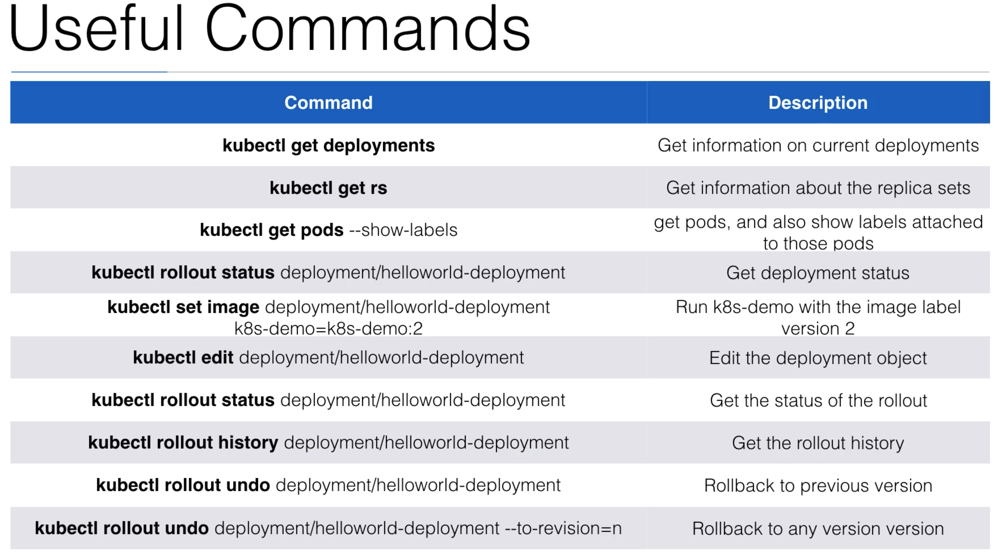

# **Kubernetes Cheat Sheet**

## Kubectl
- `kubectl run <NAME>` : Create and run a particular image, possibly replicated. Creates a deployment or job to manage the created container(s).
    - `--image` : The image for the container to run.
    - `--port` :  The port that this container exposes.
- `kubectl expose <TYPE>` : Expose a resource as a new Kubernetes service. Kubectl expose creates a new service for a pod (or other kubernetes objects). A service allows you to connect to a pod from outside the cluster, using Service type `NodePort` or `LoadBalancer`. Looks up a deployment, service, replica set, replication controller or pod by name and uses the selector for that
resource as the selector for a new service on the specified port.
    - `--port`: The port that the service should serve on
    - `--target-port` : Name or number for the port on the container that the service should direct traffic to.
        - ex) `kubectl expose deployment nginx --port=80 --target-port=8000` : Create a service for an nginx deployment, which serves on port 80 and connects to the containers on port 8000.
    - ex) `kubectl expose deployment <DEPLOYMENT_NAME> --type=NodePort`
- `kubectl get service` : List services
    - `<NAME>` : List information of the service. e.g ) NAME, TYPE, CLUSTER-IP, EXTERNAL-IP, PORT(S), AGE
- `kubectl get nodes` : List nodes
    - `--show-labels` : List nodes information including the labels
- `kubectl get pods` : List pods
- `kubectl exec <POD_NAME> -i -t -- /bin/bash` : Give shell on the specified Pod.
- `kubectl config`
    - `get-clusters` : Display clusters defined in the kubeconfig
- `kubectl create -f <FILE>` : Create a pod using the data in FILE. Create a resource from a file or from stdin. JSON and YAML formats are accepted.
- `kubectl scale --replicas=<NUM> -f <FILE_NAME>` : Using replication controller YAML file <FILE_NAME>, scale to <NUM> amount of pods
- `kubectl describe <TYPE> <NAME>` : Display information of the specified `<TYPE>`
    - ex) `kubectl describe pod <POD_NAME>` : Display information of the specified pod
    - ex) `kubectl describe service <SERVICE_NAME>`
- `kubectl delete pod <POD_NAME>` : Remove the specified pod

## Scaling
### Replication Controller
- If application is stateless, it is horizontally scalable. 
    - **Stateless**: Application doesn't have a state. Which means it doesn't write any local files/keeps local sessions. 
    - Intead of storing locally, it's possible to store their state in an external service. Like all traditional databases(MySQL, Postgres) that are stateful. They have database files that can't be split over multiple instances
    - `Horizontally` scale : The number of instances increase
    - `Vertically` scale : Increase resources like CPU, memory
- Scaling in Kubernetes can be done by `Replication Controller`. 
    - *The replication controller ensures a specified number of pod replicas will run at all time*. A pods created with the replica controller will automatically be replaced if they fail, get deleted, or are terminated. 

- `kubectl get rc` : List replication controllers
- `kubectl scale --replicas=<NUM> <NAME>` : Scale replication controller
- `kubectl delete <NAME>` : Delete replication controller

### Replica Set
- `Replica Set` is a next-generation of Replication Controller
- It supports a new selector that can do selection based on filtering according a set of values. 
    - ex) Replication Controller filtering: "environment" == "dev"
    vs 
    Replica Set filtering: "environment" either "dev" or "qa"
- The Replica Set, rather than the Replication Controller, is used by the Deployment object
- `kubectl get rs` : List of replica set

## Deployment
- With deployment object, we can
    - **Create** a deployment(e.g. deploying an app)
    - **Update** a deployment(e.g. deploying a new version)
    - Do **rolling** updates(Deploy step-by-step. Zero downtime deployments)
    - **Roll back** to a previous version
    - **Pause / Resume** a deployement(e.g. to roll-out to only a certain percentage)
- `kubectl create -f <FILE_NAME>` : Create a deployment using the <FILE_NAME>
- `kubectl get deployments` : List of deployments

## Services
- A service is a logical bridge between the 'mortal' pods and other services or end-users. 
    - Pods are very dynamic, they come and go on the Kubernetes cluster.
        - When using a Replication Controller, pods are terminated and created during scaling operations
        - When using Deployments, when updating the image version, pods are terminated and new pods take the place of older pods
    - Pods should never be accessed directly, but always through a service
- `kubectl expose` will create a new service for your pod, so it could be accessed externally.
- Creating a service will create an endpoint for pods
    - `ClusterIP`: A virtual IP address only reachable from with the cluster(this is default)
    - `NodePort`: A port that is the same on each node that is also reachable externally
    - `LoadBalancer`: A LoadBalancer created by the cloud provider that will route external traffic to every node on the NodePort(ELB on AWS)

## Labels
### Node Labels
- We can tag nodes using labels. Once nodes are tagged, by using `label selectors`, we can let pods run on *specific nodes*.
    1. First you tag the node
        - `kubectl label nodes <NODE_NAME> <KEY>=<VALUE>`
    2. Then you add a `nodeSelector` to your pod configuration
        
- Label *does not have to be unique*. We can add multiple labels to a resource
    
## Health checks

## Readiness Probe
- `livenessProbes`: Indicates whether a container is **running**
    - If the check fails, the container will be restarted
- `readinessProbles`: Indicates whether the container is **ready to serve requests**
    - If the check fails, the container will **not** be restarted, but the **Pod's IP address will be removed from the Service**, so it'll not serve any requests anymore

## Pod
### Pod State
- `kubectl get pods` shows the status of pods
    - `RUNNING` : This means that the pod has been **bound to a node**. And all **containers have been created**, and at least one container is still **running** or is starting/restarting.
    - `PENDING` : Pod has been accepted but is **not running**. Happens when the container image is still **downloading**. If the pod cannot be scheduled because of **resource constraints**, it'll also be in this status. 
    - `SUCCEEDED` : All containers within this pod have been **terminated successfully** and will not be restarted.
    - `FAILED` : All containers within this pod have been **terminated**, and at least one container returned a failure code
- `PodConditions`
    - `PodScheduled` : the pod has been scheduled to a node
    - `Ready` : Pod can serve requests and is going to be added to matching services
    - `Initialized` : the initialization containers have been started successfully
    - `Unschedulable` : the Pod can't be scheduled(e.g. due to resource constraints)
    - `ContainersReady` : all containers in the pod are ready
- `kube-proxy` : The kube-proxy will make changes to iptables to ensure correct routing to pods/services is set up

### Pod Lifecycle

- Lifecycle YAML
    - ex) 
    

    - `initContainers` : This is a separate container from main container. This would do the initial works like do some work on volumes, set some directories, set permissions, etc.

### DNS
- DNS service can be used within pods to *find other services* running on the same cluster

- Multiple containers within 1 pod don't need this service, as they can contact each other directly
    - A container in the same pod can connect the port of the other container directly using **localhost:port**

- To make DNS work, a pod will need a **Service definition**

### ConfigMap
- Configuration parameters that are not secret, can be put in a **ConfigMap**
- The input is key-value pairs
- The ConfigMap key-value pairs can then be read by the app using:
    - **Environment** variables
    - **Container commandline arguments** in the Pod configuration
    - Using **volumes**

### Pod Presets
- Pod presets can **inject information into multiple pods at runtime** 
    - Pod Presets are used to **inject Kubernetes Resources** like Secrets, ConfigMaps, Volumes and Environment variables
- Imagine you have 20 applications you want to deploy, and they all need to get a specific credential
    - You can edit the 20 specifications and add the credential, OR  
     You can use the presets to create 1 Preset object, which will inject an environment variable or config file to **all matching pods**
- When **injecting** Environment variables and VolumeMounts, the Pod Preset will apply the changes to **all containers** within the pod

### StatefulSets
- It is introduced to be able to run **stateful applications**:
    - That need a **stable pod hostname**(instead of podname-randomstring)
        - Your podname will have a sticky identity, using an index, e.g podname-0, podname-1 and podname-2(and when a pod gets rescheduled, it'll keep that identity)
    - Statefulsets allow **stateful apps stable storage** with volumes based on their ordinal number(podname-**x**)
        - **Deleting** and/or **scaling** a **StatefulSet down** will not delete the volumes associated with the StatefulSet(preserving data)
        

## References
- [Udemy learn-devops-the-complete-kubernetes-course](https://www.udemy.com/learn-devops-the-complete-kubernetes-course)
 
 
